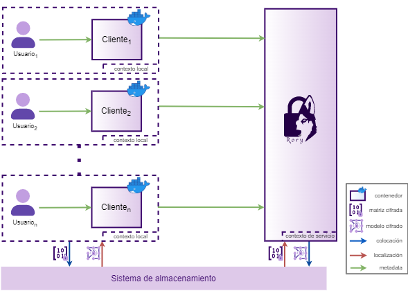

<div id="top"></div>

<!-- PROJECT LOGO -->
<br />
<div align="center">
  <a href="#">
    

  </a>
  <h3 align="center">Secure Clustering System</h3>

  <p align="center"> Brief description
</div>


<!-- TABLE OF CONTENTS -->
<details>
  <summary>Table of Contents</summary>
  <ol>
    <li>
      <a href="#getting-started">Prerequisites</a>
      <!-- <ul> -->
        <!-- <li><a href="#prerequisites">Prerequisites</a></li> -->
        <!-- <li><a href="#installation">Installation</a></li> -->
      <!-- </ul> -->
    </li>
    <li><a href="#usage">Local usage</a></li>
    <li><a href="#contributing">Contributing</a></li>
    <li><a href="#license">License</a></li>
    <li><a href="#contact">Contact</a></li>
    <!-- <li><a href="#acknowledgments">Acknowledgments</a></li> -->
  </ol>
</details>


<!-- ABOUT THE PROJECT -->
## Software Architecture
<div align="center">
  <a href="#">
    
  
  </a>

</div>


System architecure brief description

<p align="right">(<a href="#top">back to top</a>)</p>

<!-- GETTING STARTED -->
<!-- ## Getting Started

Getting started description ...  -->

## Prerequisites


The following prerequisites must be met in order to use the software correctly.
1. Environment parameters
  ```bash
    export ROOT_BASE_PATH=/rory
    export BASE_PATH=/home/sreyes/rory
    export MANAGER_PATH=$BASE_PATH/manager
    export CLIENT_PATH=$BASE_PATH/client
    export WORKER_PATH=$BASE_PATH/worker
    export MICTLANX_PATH=$BASE_PATH/Mictlanx

    export MANAGER_GUNICORN_CONFIG_FILE=$MANAGER_PATH/src/gunicorn_config.py
    export WORKER_GUNICORN_CONFIG_FILE=$WORKER_PATH/src/gunicorn_config.py
    export CLIENT_GUNICORN_CONFIG_FILE=$CLIENT_PATH/src/gunicorn_config.py
  ```

2. Folder creation
  ```bash
    $ROOT_BASE_PATH/source
    $ROOT_BASE_PATH/sink
    $ROOT_BASE_PATH/log
  ```

3. Installation of dependencies 
  
  ```sh
    pip3 install -r /rory/manager/requirements.txt
    pip3 install -r /rory/cliente/requirements.txt
    pip3 install -r /rory/worker/requirements.txt
  ```


<!-- * Flask
  ```bash
  pip install flask
  ```
* Another software dependencie -->


## Local use of the system

1. Turn on virtual environment
  ```sh
    source $BASE_PATH/rory-env/bin/activate
  ```

2. Satisfy the prerequisites mentioned above.


3. Running Mictlanx
  ```sh
      docker compose -f $MICTLANX_PATH/mictlanx.yml up -d
  ```

4. Execute each of the components 
    - **MANAGER**
      
      Locate in `$MANAGER_PATH/src` and and type in the terminal:

      ```sh
        gunicorn --config $MANAGER_GUNICORN_CONFIG_FILE main:app
      ```

    - **WORKER** 

      Locate in `$WORKER_PATH/src` and and type in the terminal:

      ```sh
        gunicorn --config $WORKER_GUNICORN_CONFIG_FILE main:app
      ```

    - **CLIENT**
      
      Locate in `$CLIENT_PATH/src` and and type in the terminal:

      ```sh
        gunicorn --config $CLIENT_GUNICORN_CONFIG_FILE main:app
      ```

5. Send a request, for example:
   
  - **Manager** `curl -X GET http://localhost:6000/clustering/test`
  - **Worker** `curl -X GET http://localhost:9000/clustering/test`
  - **Client** `curl -X GET http://localhost:3000/clustering/test`


<!-- 1. Clone the repo
   ```sh
   git clone https://github.com/ShanelReyes/rory.git
   ```
1. Install Python packages
   ```sh
   pip install -t /path/to/requirements.txt
   ``` -->

<p align="right">(<a href="#top">back to top</a>)</p>


<!-- USAGE EXAMPLES -->
<!-- ## Usage

Use this space to show useful examples of how a project can be used. Additional screenshots, code examples and demos work well in this space. You may also link to more resources.

_For more examples, please refer to the [Documentation](https://example.com)_

<p align="right">(<a href="#top">back to top</a>)</p>
 -->


<!-- CONTRIBUTING -->
## Contributing

Contributions are what make the open source community such an amazing place to learn, inspire, and create. Any contributions you make are **greatly appreciated**.

If you have a suggestion that would make this better, please fork the repo and create a pull request. You can also simply open an issue with the tag "enhancement".
Don't forget to give the project a star! Thanks again!

1. Fork the Project
2. Create your Feature Branch (`git checkout -b feature/AmazingFeature`)
3. Commit your Changes (`git commit -m 'Add some AmazingFeature'`)
4. Push to the Branch (`git push origin feature/AmazingFeature`)
5. Open a Pull Request

<p align="right">(<a href="#top">back to top</a>)</p>


<!-- LICENSE -->
## License

Distributed under the MIT License. See `LICENSE.txt` for more information.

<p align="right">(<a href="#top">back to top</a>)</p>


<!-- CONTACT -->
## Contact

 Shanel Reyes - [@ShanelReyes]() - shanel.reyes@cinvestav.mx

<p align="right">(<a href="#top">back to top</a>)</p>


<!-- ACKNOWLEDGMENTS -->
<!-- ## Acknowledgments

Use this space to list resources you find helpful and would like to give credit to. I've included a few of my favorites to kick things off!

<!-- * [Apache Kafka](https://www.confluent.io/) -->

<!-- <p align="right">(<a href="#top">back to top</a>)</p> -->

