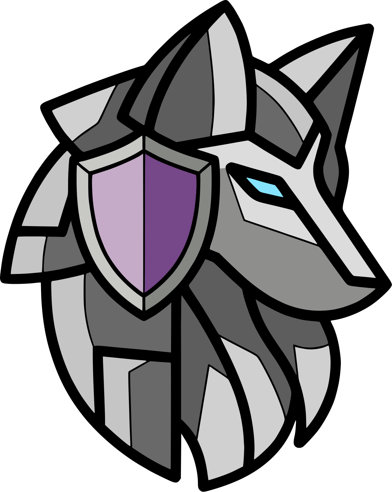

# Rory Core

<figure markdown="span">
  { width="300" }
</figure>

<div align="center">
  
  
  <a href="https://codecov.io/gh/ShanelReyes/rory_core">
    
  </a>
</div>

Rory is a **privacy-preserving machine learning** library providing secure
clustering, classification, and logistic regression using homomorphic
encryption — CKKS, Paillier, Liu, and FD-HOPE.

## Architecture

```
rory/core/
├── security/          Cryptosystems (CKKS, Paillier, Liu, FD-HOPE) & data owners
├── clustering/        KMeans, NNC + secure variants (conventional/PQC)
├── classification/    KNN + secure PQC & distributed SKNN
├── machine_learning/  Logistic Regression & PPLR
├── interfaces/        Protocol types, manager/worker contracts
├── utils/             Constants, CKKS helpers, matrix operations
├── validation_index/  Clustering validity metrics
└── logger/            Logging utilities
```

## Supported Cryptosystems

| Cryptosystem | Type | Homomorphism | Module |
|-------------|------|-------------|--------|
| **CKKS** | PQC (lattice-based) | Fully HE | `rory.core.security.cryptosystem.pqc.ckks` |
| **Paillier** | Conventional | Partially HE | `rory.core.security.cryptosystem.paillier` |
| **Liu** | Conventional | Symmetric HE | `rory.core.security.cryptosystem.liu` |
| **FDHOPE** | Conventional | Order-preserving | `rory.core.security.cryptosystem.fdhope` |

## Algorithms

| Category | Algorithms |
|----------|-----------|
| **Clustering** | KMeans, NNC, SKMeans, DBSKMeans (conventional + PQC) |
| **Classification** | KNN, Secure KNN (Liu-based + PQC/CKKS) |
| **Machine Learning** | Logistic Regression, PPLR (Privacy-Preserving LR) |

## License

MIT — see [LICENSE](https://github.com/ShanelReyes/rory_core/blob/master/LICENSE).
